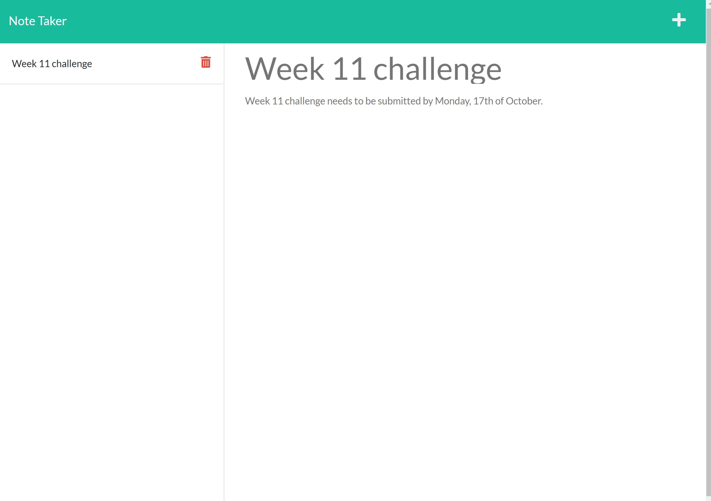

# note-taker

Note taker application using JavaScript.

## Installation

To install necessary dependencies, run the following command:

```sh
npm install
```

## Usage

Run the following command to start the application:

```sh
npm start
```

Use the UI to list, add and delete notes.The live application can be accessed [here](https://anisha-note-taker.herokuapp.com) and the screenshot below:



## Technologies used

- uuid
- Express

## License

[](https://opensource.org/licenses/MIT)

## Helpful resources

- <https://github.com/uuidjs/uuid#readme>
- <https://modernweb.com/the-basics-of-express-routes/>
